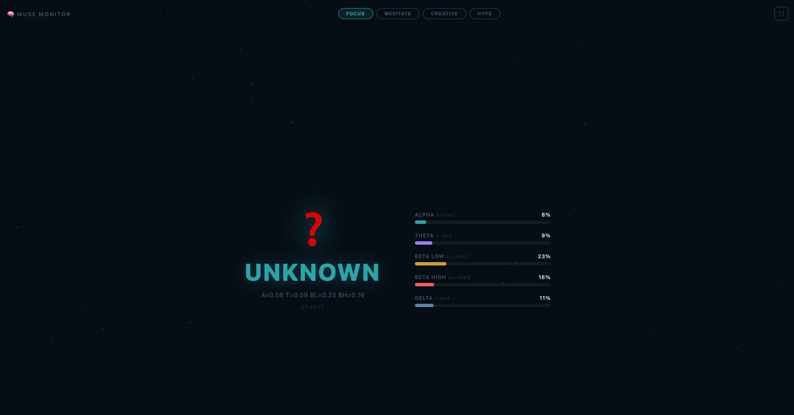

# muse-monitor

**Your MUSE headband deserves better software.**

Real-time EEG brain state dashboard for the MUSE 2 headband. Classifies your mental state live — Flow, Stress, Creative, Active — and streams it to a full-screen ambient display. Built to run on a TV via AirPlay or Chromecast while you work.



---

## What it looks like

Dark ambient background. Giant brain state front and center. Animated band power bars. 10-state history trail. Four vibe modes that shift the entire color palette. One button to go fullscreen.

---

## Requirements

- Python 3.8+
- Node.js 18+
- MUSE 2 headband (Bluetooth connected)

```bash
pip install muselsl pylsl numpy
```

Node deps install automatically on first launch.

---

## Install & run

```bash
git clone https://github.com/Swivel-OS/muse-monitor
cd muse-monitor
bash start.sh
```

That's it. Opens `http://localhost:3002` in your browser automatically.

> **Note:** Make sure your MUSE is powered on and paired via Bluetooth before running.

---

## Brain states

| State | Signal | What it means |
|-------|--------|---------------|
| 🌊 **FLOW** | Alpha dominant (8–13 Hz) | Deep focus. You're in it. Don't break the streak. |
| ⚡ **STRESS** | High Beta (20–30 Hz) | Stress spike. Maybe take a breath. |
| 🎨 **CREATIVE** | Theta dominant (4–8 Hz) | Drowsy-creative zone. Ideation mode. Capture everything. |
| ⚙️ **ACTIVE** | Low Beta (13–20 Hz) | Normal alert thinking. Working through something. |

Classification is based on relative band power over a 2-second rolling window. Thresholds are in `lsl_reader.py` — tune them to your head.

---

## Vibe modes

Four modes that change color palettes and signal what you're optimizing for:

| Mode | Color | Best for |
|------|-------|---------|
| **FOCUS** | Teal | Deep work sessions |
| **MEDITATE** | Purple | Meditation, breathwork |
| **CREATIVE** | Violet | Ideation, writing, design |
| **HYPE** | Gold | Energy, movement, prep |

Click any mode in the top bar. The background network, glow effects, and all UI elements shift instantly.

---

## Architecture

```
muselsl stream        ← streams EEG via Lab Streaming Layer (LSL)
  └─ lsl_reader.py   ← reads LSL, FFT → band powers → classify → JSON stdout
       └─ server.js  ← Node/Express + WebSocket, spawns reader, fans to browser
            └─ public/index.html  ← ambient dashboard, WebSocket client
```

The Node server spawns the Python reader as a child process and pipes JSON state updates via WebSocket to all connected browsers. If the reader crashes, it auto-restarts after 3 seconds. If the WebSocket drops, the browser reconnects automatically.

---

## Configuration

**Device name** — change `Muse-73D3` in `start.sh` to match yours:
```bash
MUSE_NAME="Muse-XXXX" bash start.sh
```

**Port** — default is 3002:
```bash
PORT=3003 bash start.sh
```

**Thresholds** — edit `THRESHOLDS` in `lsl_reader.py`:
```python
THRESHOLDS = {
    "FLOW":     {"band": "alpha",     "value": 0.35},
    "STRESS":   {"band": "beta_high", "value": 0.25},
    "CREATIVE": {"band": "theta",     "value": 0.30},
    "ACTIVE":   {"band": "beta_low",  "value": 0.30},
}
```

---

## Stop

`Ctrl+C` in the terminal, or kill the Node server:
```bash
pkill -f "node server.js"
pkill -f "muselsl stream"
```

---

## Roadmap

- [ ] Threshold calibration wizard
- [ ] Session logging to CSV with state timeline export
- [ ] Notification hooks (webhook / AppleScript when state changes)
- **Coming soon: eye-blink page turn for SOL Reader** 👁

---

## License

MIT — build something interesting with it.
